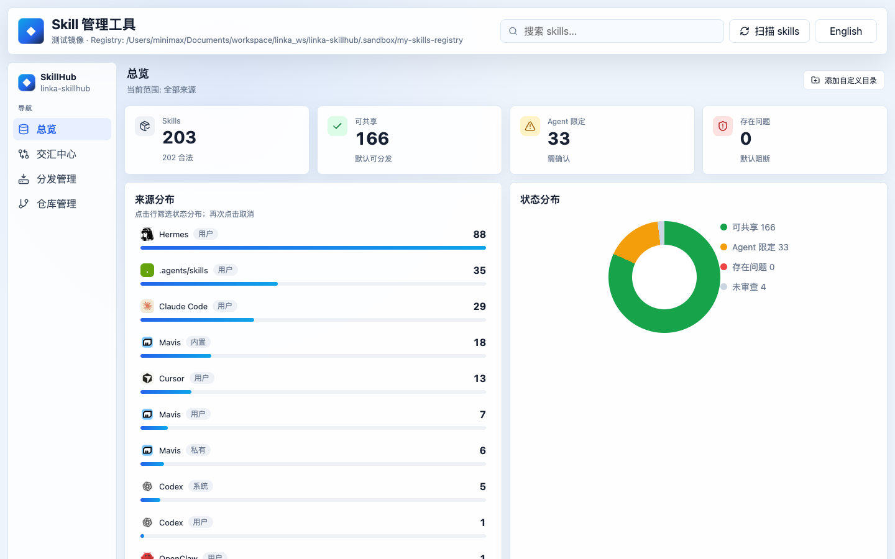

<div align="center">

# linka-skillhub

**One local registry for every coding-agent skill on your machine.**

<a href="README.zh-CN.md">中文</a>
· <a href="#quick-start">Quick start</a>
· <a href="#why-it-exists">Why</a>
· <a href="#safety-model">Safety</a>
· <a href="#cli">CLI</a>

<br />

<a href="https://github.com/hahhforest/linka-skillhub/blob/main/LICENSE"></a>


<br /><br />



</div>

## Why It Exists

Coding agents are getting useful enough that their skill libraries become real infrastructure. Then the copies multiply: Codex, Claude Code, OpenCode, Mavis, Cursor, OpenClaw, Hermes, and shared `.agents/skills` paths all start carrying slightly different versions of the same skill.

`linka-skillhub` turns that sprawl into one Git-backed source of truth.

## What It Does

- **Finds every local skill** across agent-specific and shared directories.
- **Imports canonicals** into `registry/skills/<name>/`, with normal Git history.
- **Reviews before sharing** using deterministic rules and optional code-agent reviewers.
- **Distributes safely** from the registry back to Codex, Claude, OpenCode, Mavis, Cursor, OpenClaw, Hermes, or shared paths.
- **Reconciles drift** with pull, push, fork, push-all, and agent-assisted merge.
- **Works headless or visual**: the Web console and CLI call the same core workflows.

## Quick Start

```bash
pnpm install
pnpm mirror:local
pnpm build
pnpm serve
```

Open [http://127.0.0.1:4873](http://127.0.0.1:4873).

By default, `mirror` writes only to `.sandbox/local-mirror`, so you can test with mirrored real skills before touching your actual agent directories.

## Workflow

`scan` -> `registry` -> `review` -> `distribute` -> `sync drift`

## CLI

```bash
lsh list
lsh registry import --create
lsh review --reviewer rules
lsh distribute preview --target codex,claude --skill writing-plans
lsh distribute apply --target codex,claude --skill writing-plans --yes
lsh sync status
lsh sync pull writing-plans --from claude
lsh sync merge writing-plans --from claude,opencode --by codex
lsh serve
```

During local development, use `pnpm lsh -- <command>` after `pnpm build`, or `pnpm lsh:dev -- <command>` to run the TypeScript entrypoint.

## Profiles

| Profile | Writes to real agent dirs? | Best for |
|---|---:|---|
| `mirror` | No | Default testing with mirrored real skills. |
| `sandbox` | No | Small deterministic fixtures. |
| `local` | Yes | Intentional writes to your real machine. |

Real skill directories are opt-in: use `--profile local`, and pass `--yes` for non-interactive writes.

## Safety Model

- Preview first, apply second for distribution writes.
- Web apply requires a live server-side `confirmToken`.
- Unsafe, invalid, and agent-bound skills are excluded unless explicitly included.
- Registry writes are path-checked inside the active profile repo.
- `registry/instances.json` is ignored by Git because it contains machine-local paths.
- Overwrites create backups under the active `stateDir`.

## Web Console

The browser UI is intentionally thin. It presents the same operations the CLI runs:

| Page | Use it for |
|---|---|
| Overview | Search skills, inspect status, source distribution, history, and evidence. |
| Intersect | Copy selected skills from one agent to another. |
| Distribute | Push registry skills to several agents with preview and confirmation. |
| Repo | Import, review, switch registry, bind a remote, pull, push, and browse history. |

## Development

```bash
pnpm typecheck
pnpm test
pnpm build
pnpm verify
```

`pnpm verify` runs typecheck, tests, production build, UI audit, and UI flow checks.

## License

MIT
