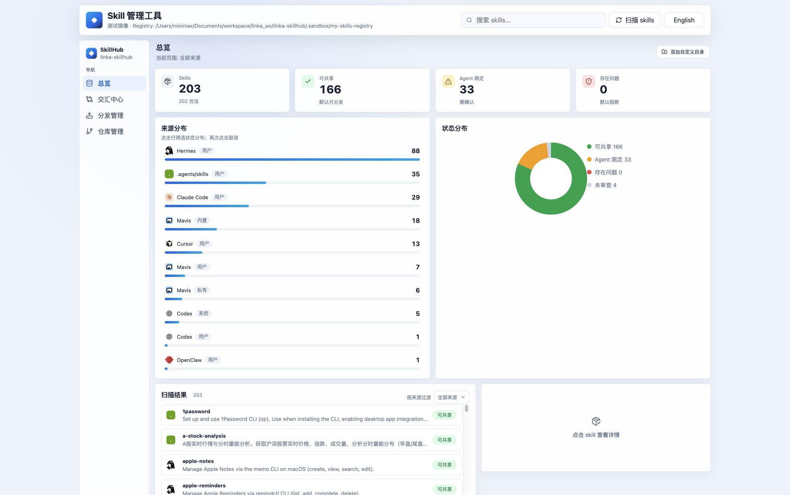

<div align="center">

# linka-skillhub

**把你机器上所有 coding-agent skills 收到一个本地 Registry。**

<a href="README.md">English</a>
· <a href="#快速开始">快速开始</a>
· <a href="#为什么需要它">为什么需要它</a>
· <a href="#安全模型">安全模型</a>
· <a href="#cli">CLI</a>

<br />

<a href="https://github.com/hahhforest/linka-skillhub/blob/main/LICENSE"></a>


<br /><br />



</div>

## 为什么需要它

coding agent 的技能库一旦变多，就会变成真正需要管理的基础设施。Codex、Claude Code、OpenCode、Mavis、Cursor、OpenClaw、Hermes，以及共享 `.agents/skills` 路径里，常常会散落同一个 skill 的不同版本。

`linka-skillhub` 把这些分散的副本收进一个 Git 版本化的中心。

## 它能做什么

- **扫描本地 skills**：覆盖 agent 专属目录和共享目录。
- **导入 canonical**：统一放到 `registry/skills/<name>/`，历史走 Git。
- **分发前审查**：用确定性规则，也可以调用 code-agent reviewer。
- **安全分发**：从 Registry 推回 Codex、Claude、OpenCode、Mavis、Cursor、OpenClaw、Hermes 或 shared 目录。
- **处理 drift**：支持 pull、push、fork、push-all 和 agent-assisted merge。
- **CLI / Web 双入口**：Web 控制台和 CLI 复用同一套 core workflow。

## 快速开始

```bash
pnpm install
pnpm mirror:local
pnpm build
pnpm serve
```

打开 [http://127.0.0.1:4873](http://127.0.0.1:4873)。

默认 `mirror` profile 只写 `.sandbox/local-mirror`，可以先用真实 skill 的镜像测试，不会碰你的真实 agent 目录。

## 工作流

`scan` -> `registry` -> `review` -> `distribute` -> `sync drift`

## CLI

```bash
lsh list
lsh registry import --create
lsh review --reviewer rules
lsh distribute preview --target codex,claude --skill writing-plans
lsh distribute apply --target codex,claude --skill writing-plans --yes
lsh sync status
lsh sync pull writing-plans --from claude
lsh sync merge writing-plans --from claude,opencode --by codex
lsh serve
```

本地开发时，`pnpm build` 后可以用 `pnpm lsh -- <command>`；如果要直接跑 TypeScript 入口，用 `pnpm lsh:dev -- <command>`。

## Profiles

| Profile | 会写真实 agent 目录吗 | 适合场景 |
|---|---:|---|
| `mirror` | 否 | 默认，用真实 skills 的镜像安全测试。 |
| `sandbox` | 否 | 小型确定性 fixtures。 |
| `local` | 是 | 明确要写入真实机器目录。 |

真实 skill 目录默认不会被写入；需要显式使用 `--profile local`，非交互写操作还要传 `--yes`。

## 安全模型

- 分发写入必须先 preview，再 apply。
- Web apply 需要服务端生成的实时 `confirmToken`。
- unsafe、invalid、agent-bound skills 默认排除，除非显式包含。
- Registry 写入会做路径检查，并限制在当前 profile repo 内。
- `registry/instances.json` 包含本机路径，因此被 Git 忽略。
- 覆盖写入前会在当前 `stateDir` 下创建备份。

## Web 控制台

Web UI 只负责呈现和交互，底层仍然调用 CLI 使用的 core workflow。

| 页面 | 用途 |
|---|---|
| Overview | 搜索 skills，查看状态、来源分布、历史和证据。 |
| Intersect | 从一个 agent 复制选中的 skills 到另一个 agent。 |
| Distribute | 预览并确认把 Registry skills 推到多个 agents。 |
| Repo | 导入、审查、切换 Registry、绑定 remote、pull、push、查看历史。 |

## 开发

```bash
pnpm typecheck
pnpm test
pnpm build
pnpm verify
```

`pnpm verify` 会运行类型检查、测试、生产构建、UI audit 和 UI flow checks。

## License

MIT
